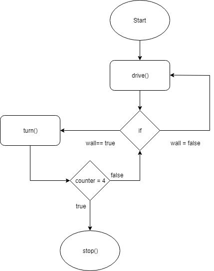

# Flæðirit og sauðakóði
Hér skal gera flæðirit og sauðakóða nýtið ykkur https://draw.io. Þegar þið hafið lokið að gera flæðiritið farið í export-image og vistið grafið í skyrsla/img meðnafni "flowhart". í Þessu skjali skuluð þið gera sauðakóða 

Sauðakóða dæmi:
```
cnt = 0
loop forever{
  drive()
  if (wall == true)
  {
    turn()
    cnt ++1
  }
  else
  {
    drive()
  }
  if (cnt == 4)
  {
    stop()
  }
}
 ```


